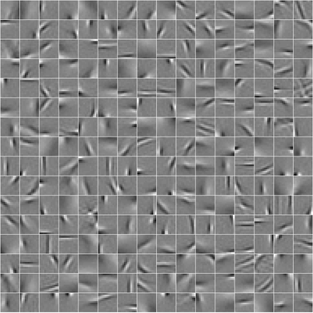
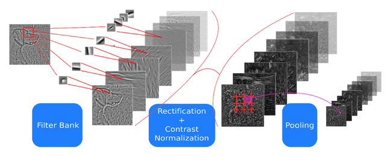
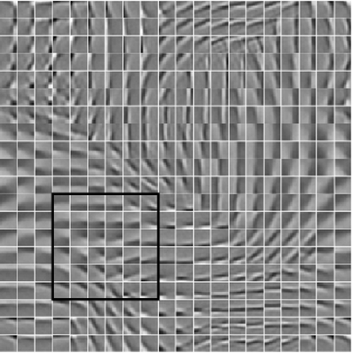
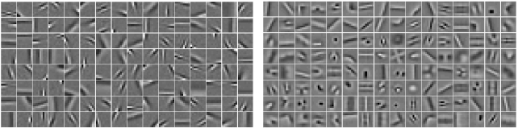

## Learning Feature Extractors Using Sparse Coding

I am interested in unsupervised learning of feature hierarchies and mostly worked on sparse and overcomplete representations. We have developed **Predictive Sparse Decomposition (PSD)** method that jointly trains a sparse coding dictionary and an efficient predictor function that produces approximations to sparse representations. Below 12x12 dictionary elements trained on natural image patches from Berkeley dataset are shown. Details of this method are explained in the arxiv report **Fast Inference in Sparse Coding Algorithms with Applications to Object Recognition**.

- - -

##Hierarchical Models for Object Recognition

In our ICCV 2009 paper (**What is the Best Multi-Stage Architecture for Object Recognition?**), we have used PSD model as a generic feature extraction stage to build multi-stage object recognition systems. We have also analyzed the importance of different non-linear transformation functions that can be used in between stages.

- - -

## Learning Invariant Feature Representations

We have also improved PSD to obtain locally invariant representations using group sparsity criterion with overlapping group definitions. In this work, we show that our system can learn to be invariant to local transformations in data without any hard-coded invariance operations in the system. In our CVPR 2009 paper (**Learning Invariant Features through Topographic Filter Maps**), we explain the details of the model and provide recognition performance and invariance comparisons with widely adopted SIFT features.

- - -

## Convolutional Predictive Sparse Decomposition

In our paper **Learning Convolutional Feature Hierarchies for Visual Recognition** at NIPS 2010, we show that patch based learning of features based on sparse modeling produces very redundant features. Convolutional formulation of the problem avoids redundancy by not modeling every feature at its all translations and learns a much richer set of features. Below, on the left a sparse coding dictionary learned using patch based model and on the right a sparse coding dictionary learned using convolutional model.

- - -

## Collaborators

 - [Vlad Mnih](https://cs.toronto.edu/~vmnih)
 - [Yann LeCun](http://cs.nyu.edu/~yann)
 - [Rob Fergus](http://cs.nyu.edu/~fergus)
 - [Ronan Collobert](http://ronan.collobert.com/)
 - [Clement Farabet](http://www.clement.farabet.net/)
 - [Karol Gregor](http://cs.nyu.edu/~kgregor)
 - Kevin Jarrett
 - [Marc'Aurelio Ranzato](http://cs.nyu.edu/~ranzato)
 - [Pierre Sermanet](http://cs.nyu.edu/~sermanet/)
 - [Arthur Szlam](http://www.math.ucla.edu/~aszlam/)
 - [Jason Weston](http://www.kyb.mpg.de/bs/people/weston/)
